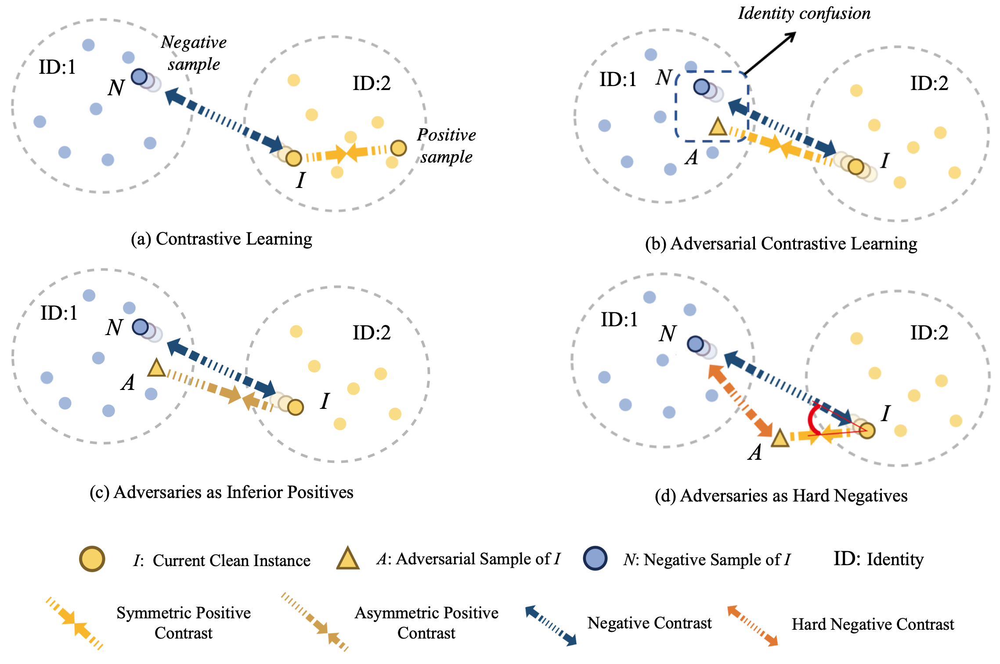

# Adversarial Contrastive Learning via Asymmetric InfoNCE



This is a PyTorch implementation of the paper [Adversarial Contrastive Learning via Asymmetric InfoNCE](https://arxiv.org/abs/2207.08374) (ECCV 2022). 

## Preparation

In each sub-directory (`./Asym-AdvCL`, `./Asym-RoCL`) for each baseline, please first create  `./logs` directories, then download CIFAR datasets into `～/data`. All models will be stored in `./checkpoint`, and logs stored in `./logs`.

### Environment requirements

- PyTorch >= 1.8
- NVIDIA apex
- numpy
- tensorboard_logger
- [torchlars](https://github.com/kakaobrain/torchlars) == 0.1.2
- [pytorch-gradual-warmup-lr](https://github.com/ildoonet/pytorch-gradual-warmup-lr)
- [diffdist](https://github.com/ag14774/diffdist) == 0.1

This repo is a modification on the [RoCL](https://github.com/Kim-Minseon/RoCL) and [AdvCL](https://github.com/LijieFan/AdvCL) repos. Environments can also be installed according to the requirements of [RoCL](https://github.com/Kim-Minseon/RoCL) and [AdvCL](https://github.com/LijieFan/AdvCL) for experiments of each baseline.

## Training

We provide shells for reproducing our main results in Table 1. The hyperparameter settings of baselines are the same as their original papers reported. All experiments were conducted on 2 Tesla V100 GPUs.

First, for [RoCL](https://arxiv.org/abs/2006.07589):

* RoCL on CIFAR10

```bash
sh shell/rocl-cifar10.sh rocl-cifar10 ResNet18 cifar-10 | tee logs/rocl-cifar10.log 
```

* RoCL-IP (RoCL with inferior positive) on CIFAR10

```bash
sh shell/rocl-IP-cifar10.sh rocl-IP-cifar10 ResNet18 cifar-10 | tee logs/rocl-IP-cifar10.log 
```

* RoCL-HN (RoCL with hard negative) on CIFAR10

```bash
sh shell/rocl-HN-cifar10.sh rocl-HN-cifar10 ResNet18 cifar-10 | tee logs/rocl-HN-cifar10.log 
```

* RoCL-IPHN (RoCL with both) on CIFAR10

```bash
sh shell/rocl-IPHN-cifar10.sh rocl-IPHN-cifar10 ResNet18 cifar-10 | tee logs/rocl-IPHN-cifar10.log 
```

* RoCL on CIFAR100

```bash
sh shell/rocl-cifar100.sh rocl-cifar100 ResNet18 cifar-100 | tee logs/rocl-cifar100.log 
```

* RoCL-IP on CIFAR100

```bash
sh shell/rocl-IP-cifar100.sh rocl-IP-cifar100 ResNet18 cifar-100 | tee logs/rocl-IP-cifar100.log 
```

* RoCL-HN on CIFAR100

```bash
sh shell/rocl-HN-cifar100.sh rocl-HN-cifar100 ResNet18 cifar-100 | tee logs/rocl-HN-cifar100.log
```

* RoCL-IPHN on CIFAR100

```bash
sh shell/rocl-IPHN-cifar100.sh rocl-IPHN-cifar100 ResNet18 cifar-100 | tee logs/rocl-IPHN-cifar100.log 
```

For [AdvCL](https://arxiv.org/pdf/2111.01124.pdf):

* AdvCL on CIFAR10

```bash
sh shell/cifar10/advcl-cifar10.sh advcl-cifar10 | tee logs/advcl-cifar10.log
```

* AdvCL-IP on CIFAR10

```bash
sh shell/cifar10/advcl-IP-cifar10.sh advcl-IP-cifar10 | tee logs/advcl-IP-cifar10.log
```

* AdvCL-HN on CIFAR10

```bash
sh shell/cifar10/advcl-HN-cifar10.sh advcl-HN-cifar10 | tee logs/advcl-HN-cifar10.log
```

* AdvCL-IPHN on CIFAR10

```bash
sh shell/cifar10/advcl-IPHN-cifar10.sh advcl-IPHN-cifar10 | tee logs/advcl-IPHN-cifar10.log
```

* AdvCL on CIFAR100

```bash
sh shell/cifar100/advcl-cifar100.sh advcl-cifar100 | tee logs/advcl-cifar100.log
```

* AdvCL-IP on CIFAR100

```bash
sh shell/cifar100/advcl-IP-cifar100.sh advcl-IP-cifar100 | tee logs/advcl-IP-cifar100.log
```

* AdvCL-HN on CIFAR100

```bash
sh shell/cifar100/advcl-HN-cifar100.sh advcl-HN-cifar100 | tee logs/advcl-HN-cifar100.log
```

* AdvCL-IPHN on CIFAR100

```bash
sh shell/cifar100/advcl-IPHN-cifar100.sh advcl-IPHN-cifar100 | tee logs/advcl-IPHN-cifar100.log
```

## Citation

If you find our work useful or provides some new insights about adversarial contrastive learning:blush:, please consider citing:

```
@inproceedings{yu2022adversarial,
  title={Adversarial Contrastive Learning via Asymmetric InfoNCE},
  author={Yu, Qiying and Lou, Jieming and Zhan, Xianyuan and Li, Qizhang and Zuo, Wangmeng and Liu, Yang and Liu, Jingjing},
  booktitle={European Conference on Computer Vision},
  pages={53--69},
  year={2022},
  organization={Springer}
}
```

## Acknowledgements

We thank for the code implementation from [RoCL](https://github.com/Kim-Minseon/RoCL), [AdvCL](https://github.com/LijieFan/AdvCL), [HCL](https://github.com/joshr17/HCL) and [SupContrast](https://github.com/HobbitLong/SupContrast).
